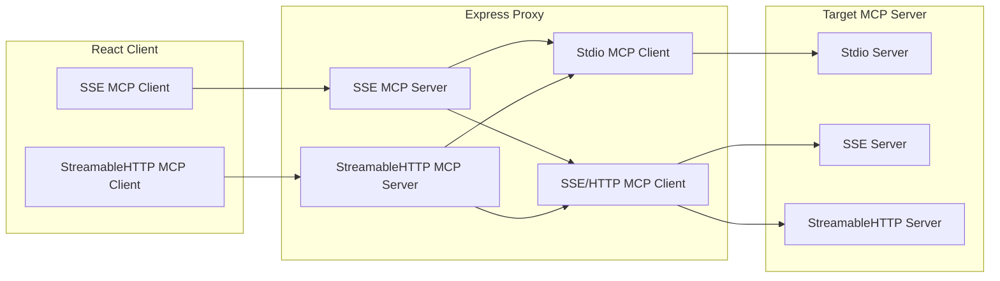
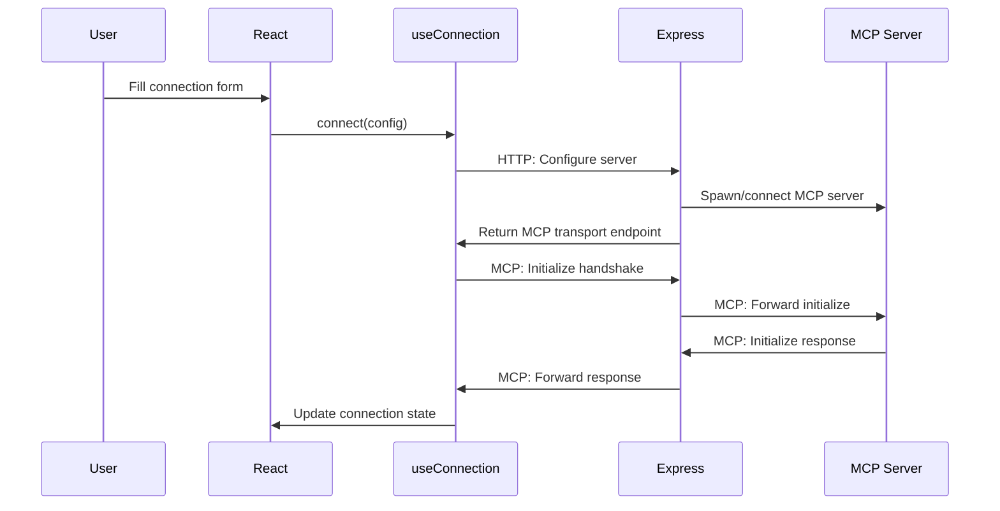
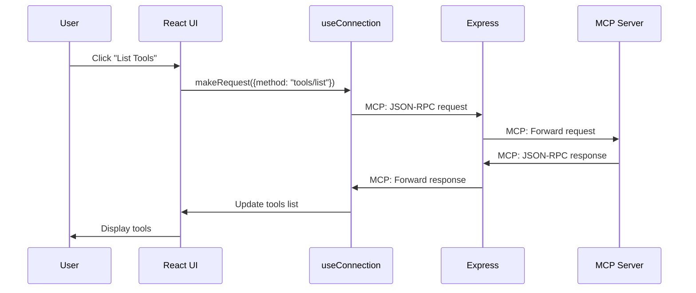

# MCP Inspector Architecture

This document explains the internal architecture and design decisions of the MCP Inspector.

## Architecture Type

The MCP Inspector uses a **traditional client-server architecture** with:
- **Frontend**: React SPA (Single Page Application) built with Vite, served as static files
- **Backend**: Express.js HTTP server with TypeScript

**Important**: This is **not** a server-side React application (no Next.js, no SSR/SSG). The React frontend and Express backend are completely separate applications.

## System Components

```mermaid
graph TB
    subgraph "Browser (Port 6274)"
        UI[React SPA<br/>Inspector UI]
    end
    
    subgraph "Express Server (Port 6277)"
        Proxy[Express Proxy<br/>mcpProxy function]
    end
    
    subgraph "MCP Server Process"
        Server[Target MCP Server<br/>stdio/SSE/HTTP]
    end
    
    UI --|"1. HTTP (management)<br/>2. MCP Protocol"| Proxy
    Proxy --|"MCP Protocol<br/>(stdio/SSE/HTTP)"| Server
```

## Communication Stages

### Stage 1: HTTP Management (React ↔ Express)

React communicates with Express via standard HTTP for MCP server lifecycle management:

**MCP Connection Endpoints:**
- `GET /stdio?command=...&args=...&env=...` - Spawn new MCP server process via stdio
- `GET /sse?url=...` - Connect to existing MCP server via SSE  
- `POST /mcp?url=...` - Connect to existing MCP server via StreamableHTTP

**Configuration Endpoint:**
- `GET /config` - Retrieve default environment variables and command settings

**Purpose:** MCP server spawning/connection and configuration retrieval

### Stage 2: MCP Protocol Communication (React ↔ Express ↔ MCP Server)

After server setup, React uses MCP Client with MCP SDK to communicate:

**React Side:**
```typescript
// React creates MCP client with MCP transport
const client = new Client({name: "mcp-inspector"});
const transport = new SSEClientTransport("http://localhost:6277/sse");
await client.connect(transport);

// Uses inspector's makeRequest wrapper function
const response = await makeRequest({method: "tools/list"}, ListToolsResultSchema);
```

**Express Side:**
```typescript
// Express uses mcpProxy to forward JSON-RPC messages
mcpProxy({
  transportToClient: sseServerTransport,    // Talks to React
  transportToServer: stdioClientTransport   // Talks to MCP server
});
```

**Message Flow:**
```
React MCP Client → MCP transport → Express Proxy → MCP Server
```

### Express Server Role

The Express server is a **pure JSON-RPC message forwarder**, not an MCP server itself:

1. **Spawns/connects** to target MCP servers based on HTTP configuration requests
2. **Creates MCP transport pairs** (server-side to React, client-side to MCP server)
3. **Forwards JSON-RPC messages** bidirectionally via `mcpProxy` function
4. **Provides configuration endpoints** for React app setup

### MCP Server Lifecycle Management

The Express server handles three distinct patterns for MCP server management:

#### Process Spawning (stdio transport)
```typescript
// GET /stdio?command=...&args=...&env=... (server/src/index.ts:369-434)
let serverTransport: Transport | undefined;
serverTransport = await createTransport(req); // Spawns new process via StdioClientTransport

const webAppTransport = new SSEServerTransport("/message", res);
console.log("Created client transport");

webAppTransports.set(webAppTransport.sessionId, webAppTransport);
serverTransports.set(webAppTransport.sessionId, serverTransport);

await webAppTransport.start();

mcpProxy({
  transportToClient: webAppTransport,    // SSE to React + POST /message from React
  transportToServer: serverTransport     // stdio to spawned process
});
```

#### Server Connection (SSE transport)  
```typescript
// GET /sse?url=http://localhost:3000/events (server/src/index.ts:436-488)
let serverTransport: Transport | undefined;
serverTransport = await createTransport(req); // Connects to existing server via SSEClientTransport

if (serverTransport) {
  const webAppTransport = new SSEServerTransport("/message", res);
  webAppTransports.set(webAppTransport.sessionId, webAppTransport);
  console.log("Created client transport");
  serverTransports.set(webAppTransport.sessionId, serverTransport!);
  console.log("Created server transport");

  await webAppTransport.start();

  mcpProxy({
    transportToClient: webAppTransport,    // SSE to React + POST /message from React
    transportToServer: serverTransport     // SSE to existing server
  });
}
```

#### HTTP Connection (StreamableHTTP transport)
```typescript
// POST /mcp?url=http://localhost:8080/mcp (server/src/index.ts:262-335)
const sessionId = req.headers["mcp-session-id"] as string | undefined;
let serverTransport: Transport | undefined;

if (!sessionId) {
  // New connection
  serverTransport = await createTransport(req); // Connects via StreamableHTTPClientTransport
  console.log("Created StreamableHttp server transport");

  const webAppTransport = new StreamableHTTPServerTransport({
    sessionIdGenerator: randomUUID,
    onsessioninitialized: (sessionId) => {
      webAppTransports.set(sessionId, webAppTransport);
      serverTransports.set(sessionId, serverTransport!);
      console.log("Client <-> Proxy  sessionId: " + sessionId);
    },
  });
  console.log("Created StreamableHttp client transport");

  await webAppTransport.start();

  mcpProxy({
    transportToClient: webAppTransport,    // HTTP to/from React on /mcp
    transportToServer: serverTransport     // HTTP to existing server
  });

  await webAppTransport.handleRequest(req, res, req.body);
} else {
  // Existing connection - route to existing transport
  const transport = webAppTransports.get(sessionId) as StreamableHTTPServerTransport;
  await transport.handleRequest(req, res);
}
```

### mcpProxy Function Usage

The `mcpProxy` function is called **immediately after transport pair creation** in all three endpoint handlers:

```typescript
export default function mcpProxy({transportToClient, transportToServer}) {
  // Forward React → MCP Server
  transportToClient.onmessage = (message) => {
    transportToServer.send(message).catch(handleError);
  };
  
  // Forward MCP Server → React  
  transportToServer.onmessage = (message) => {
    transportToClient.send(message).catch(handleError);
  };
  
  // Lifecycle: Close both transports when either closes
  transportToClient.onclose = () => transportToServer.close();
  transportToServer.onclose = () => transportToClient.close();
}
```

**Key Point:** Express creates transport pairs **before** React's MCP client connects, enabling immediate message forwarding when the React client initiates the MCP handshake.

### Server Transport Implementation Details

**webAppTransport** represents the server-side MCP transport that communicates with React:

- **SSEServerTransport**: Uses bidirectional communication via SSE + HTTP POST
  - Sends messages to React via Server-Sent Events
  - Receives messages from React via HTTP POST to `/message` endpoint
  - The `/message` endpoint is a real Express route that handles incoming POST requests

- **StreamableHTTPServerTransport**: Uses unified HTTP communication
  - Handles all communication (sending + receiving) on the same endpoint (`/mcp`)
  - Manages sessions with automatic session ID generation

**The `/message` endpoint** is an actual Express POST route (server/src/index.ts:490-512):
```typescript
app.post("/message", originValidationMiddleware, authMiddleware, async (req, res) => {
  try {
    const sessionId = req.query.sessionId;
    console.log(`Received POST message for sessionId ${sessionId}`);

    const transport = webAppTransports.get(sessionId as string) as SSEServerTransport;
    if (!transport) {
      res.status(404).end("Session not found");
      return;
    }
    await transport.handlePostMessage(req, res);
  } catch (error) {
    console.error("Error in /message route:", error);
    res.status(500).json(error);
  }
});
```

This endpoint routes incoming POST messages from React to the appropriate SSE server transport instance using the session ID.

## MCP Transport Abstraction

The inspector supports multiple MCP transport types:



**Key Design:** Express acts as both MCP client (to target server) and MCP server (to React), using different MCP transports for each connection.

## React Client Architecture

### Connection Management

The `useConnection` hook manages the complete MCP client lifecycle:

```typescript
// State management
const [mcpClient, setMcpClient] = useState<Client | null>(null);
const [connectionStatus, setConnectionStatus] = useState<ConnectionStatus>("disconnected");

// Connection establishment
const connect = async (config) => {
  // 1. HTTP request to Express to create/configure MCP server
  const transportUrl = await configureServer(config);
  
  // 2. Create MCP client with MCP transport to Express
  const client = new Client({name: "mcp-inspector", version: "..."});
  const transport = new SSEClientTransport(transportUrl);
  
  // 3. MCP initialize handshake
  await client.connect(transport);
  
  // 4. Store in React state
  setMcpClient(client);
  setConnectionStatus("connected");
};
```

### Request/Response Pattern

The `useConnection` hook provides a `makeRequest` wrapper that components use:

```typescript
// In App.tsx component
const listTools = async () => {
  const response = await makeRequest(
    {method: "tools/list", params: {}}, 
    ListToolsResultSchema
  );
  setTools(response.tools);
};
```

## Message Flow Architecture

### JSON-RPC Processing Levels

Messages exist at different abstraction levels:

1. **React App Level**: MCP request objects
   ```typescript
   {method: "tools/list", params: {}}
   ```

2. **MCP SDK Level**: Complete JSON-RPC messages
   ```typescript
   {jsonrpc: "2.0", id: 1, method: "tools/list", params: {}}
   ```

3. **Proxy Level**: Raw JSON-RPC forwarding
   ```typescript
   // Sees all complete messages flowing through
   ```

### Request vs Notification Patterns

The MCP protocol uses two distinct communication patterns:

**Request/Response (Synchronous):**
```typescript
// Inspector components use makeRequest wrapper
const response = await makeRequest({method: "tools/list"}, ListToolsResultSchema);
// Each request gets unique ID, response matched by ID
```

**Notifications (Asynchronous):**
```typescript
// useConnection sets up notification handlers
client.setNotificationHandler(LoggingMessageSchema, onNotification);
// Server sends spontaneous messages, handlers process them
```

## Component Interaction Patterns

### Connection Lifecycle



### Request Execution



## Design Decisions and Trade-offs

### Message History Implementation

**Current approach:** React tracks request/response pairs at MCP SDK level
- Stores MCP request objects: `{method: "initialize", params: {}}`
- Missing JSON-RPC envelope: `jsonrpc`, `id` fields
- Special case handling for initialize request (manually constructed)

**Limitation:** Incomplete message context for debugging JSON-RPC protocol issues

**Alternative:** Proxy-level capture would provide complete JSON-RPC visibility

### Transport Configuration

The inspector dynamically configures MCP connections based on user input:

```typescript
// User provides server configuration
const config = {
  command: "python server.py",
  args: ["--arg1", "value"],
  env: {"KEY": "value"},
  transportType: "stdio" | "sse" | "streamable-http"
};

// Express creates appropriate MCP transport to target server
const targetTransport = transportType === "stdio" 
  ? new StdioClientTransport({command, args, env})
  : new SSEClientTransport(new URL(url));
```

This allows testing any MCP server regardless of its MCP transport implementation.

## Architectural Implications

### For Debugging MCP Servers
- **Protocol visibility**: Complete JSON-RPC message flow observable at proxy level
- **Transport flexibility**: Test same server with different MCP transport types
- **Error isolation**: Separate client/server errors from transport/connection errors

### For Development
- **Independent deployment**: Frontend and backend can be developed/deployed separately
- **Component separation**: UI logic separate from proxy/forwarding logic
- **Testing**: Can mock either frontend or backend independently

### For Message Inspection
- **Current state**: UI shows MCP request objects (incomplete JSON-RPC context)
- **Proxy advantage**: Has access to complete JSON-RPC messages
- **Enhancement opportunity**: Serve complete message history via HTTP API

## Security Considerations

- **Local development tool**: Designed for localhost debugging, not production
- **Process spawning**: Express server can spawn arbitrary commands (stdio MCP transport)
- **CORS configuration**: Configured for local development origins
- **Authentication**: Optional token-based auth for multi-user scenarios